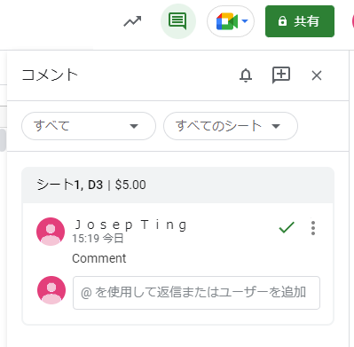

# What is GitHub

最近ソースコードの流出等で、「GitHub」を耳にするの増えてくるも。プログラマーじゃないけど、GitHubについて理解できるのか。

## 0. 概要

1. [バージョン管理システム](#1-vcs-バージョン管理システム)
2. [Gitとは](#2-gitとは)
   1. [Repository](#i-repository-リポジトリ)
   2. [Commit](#ii-commit-コミット)
   3. [Branch](#iii-branch-ブランチ)
   4. [Tag](#iv-tag-タグ)
3. [GitHubとは](#3-githubとは)
   1. [Issue](#i-issue-イシュー)
   2. [Pull request](#ii-pull-request-プルリクエスト)
      1. [Review](#a-review-レビュー)
4. [著作権について](#4-著作権について)
5. [デモ](#5-デモ)
6. [質問](#6-質問)

## 1. Version Control System

Version control isn't exclusive to source codes but it's also widely used in office suite like Excel, PowerPoint and Word.

[Git](https://ja.wikipedia.org/wiki/Git) is one of the many version control system. Before Git, there were something called Mercurial but Bitbucket ended its Mercurial support in July 2020. There was also SVN (Subversion) which was fairly used in general. However, Git is usually the only choice in most cases these days.

## 2. What is Git

It was a version control system created by Linus Torvalds, creator of Linux kernel for the development of Linux kernel.

### i. Repository

A **folder** of which is tracked by Git for changes.

Equivalent in Google Sheets: File

### ii. Commit

Single change within a repository.

In a single change, it is possible to specify multiple files/folders.

Equivalent in Google Sheets: 1 change record

### iii. Branch

Branch can be set to point to a single commit.

Equivalent in Google Sheets: not applicable (copied file is the closest meaning)

### iv. Tag

Similar to branch but commits can be added to a branch while tag is read-only.

Can be pointed to a single commit and can't be changed.

Equivalent in Google Sheets: same as branch

## 3. What is GitHub

Github is a platform providing hosting service for Git repositories.

Git by itself doesn't allow publishing on the Internet. GitHub allows easy publishing git repositories on the Internet.

For example, Linux kernel's repository is published at [git.kernel.org](https://git.kernel.org/pub/scm/linux/kernel/git/torvalds/linux.git/). Before Git, FTP or patch files via mailing list was used.

GitHub also provides features to easily communicate with collaborators.

### i. Issue

リポジトリについてコミュニケーションを取る場。

利用例：

1. 1つの機能を実現するために、タスク分割し、タスク・進捗管理する
2. 不具合発見された場合、不具合の詳細を投稿し、報告する
3. 新しい機能の提案

基本的に、タスクと相当するもの。Issue起票するにより、何かしらの実装を行い、クローズさせるのが一般的なフロー。

相応しくない利用例：

1. 質問
2. 議論
3. 情報共有
4. リポジトリに直接関連しないもの
5. 告知

上記の場合はDiscussionsを使うべき。クローズにする条件がはっきりしていないもの。

Google Sheetsで例えるなら：コメント

### ii. Pull request (プルリクエスト)

マージ先：ブランチA（リポジトリのmainブランチが一般的、他にもdevelop等もある）
マージ元：ブランチB（自分が修正し、作成したブランチ）

マージ元から作ったブランチで、コミットを追加した。作ったブランチの修正をマージ元に取り入れることがpullという。

基本的にPullはリポジトリの所有者しかできないことなので、それを依頼するのがpull requestという。

Google Sheetsで例えるなら：該当するものがない（Google Docsなら提案モードが近い）

#### a. Review (レビュー)

自分のリポジトリにこの修正を取り入れて欲しいという依頼が来たとき、どのような修正なのかはレビューすることという。

GitHubは機能豊富なサービスだが、以上はよく使われる機能である。[GitHubのドキュメント](https://docs.github.com/ja)もあるので、知りたい方はここを参考にするのがいいでしょう。

## 4. 著作権について

- プログラムは著作物（_creative work_）
- 著作権 (_copyright_) は著作物を創作した時点で自動的に発生する
- GitHub等で公開されただけで、許可なく使用してはいけない
   - 使用許可 (LICENSE) の確認を必ず行う
- GitHubに上げたコンテンツは投稿者が責任を持つ

## 5. デモ

- [職務経歴書](https://github.com/j-ting1/resume)
- [次何観よう？](https://github.com/j-ting1/to-watch)の共同リポジトリ（Issueとpull requestのサンプル）

## 6. 質問

以上説明したものから不明点、ここで説明していないが、GitHub、Gitの使い方について聞きたい等あれば。
