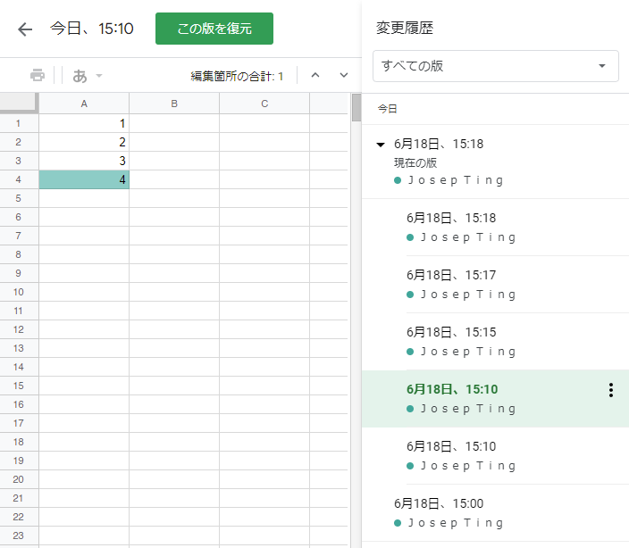

# GitHubについて

最近ソースコードの流出等で、「GitHub」を耳にするの増えてくるも。プログラマーじゃないけど、GitHubについて理解できるのか。

## 0. 概要

1. [バージョン管理システム](#1-vcs-バージョン管理システム)
2. [Gitとは](#2-gitとは)
   1. [Repository](#i-repository-リポジトリ)
   2. [Commit](#ii-commit-コミット)
   3. [Branch](#iii-branch-ブランチ)
   4. [Tag](#iv-tag-タグ)
3. [GitHubとは](#3-githubとは)
   1. [Issue](#i-issue-イシュー)
   2. [Pull request](#ii-pull-request-プルリクエスト)
      1. [Review](#a-review-レビュー)
4. デモ
5. 質問

## 1. VCS バージョン管理システム

バージョン管理及びバージョン履歴はソースコードだけでなく、Excel、PowerPoint、Word等のファイルバージョンも利用される場面が多々ある。

[Git](https://ja.wikipedia.org/wiki/Git)はバージョン管理ソフトウェアの一つ。Gitの他にもMercurialがあるが、対応してたBitbucketが2020年7月からサポート終了との発表があった。更に前では、SVN（Subversion）が一般的に利用されていた。現在はほぼGitの1択になっている。

## 2. Gitとは

Linuxカーネルを開発されたリーナス・トーバルズ氏が、Linuxカーネルの開発のために作ったバージョン管理システムである。

### i. Repository (リポジトリ)

Gitのバージョン管理対象にする**フォルダー**を指す。

Google Sheetsで例えるなら：ファイル

### ii. Commit (コミット)

リポジトリ内で、記録している修正を指す。

複数ファイル、フォルダーの修正を記録させることもできる。

Google Sheetsで例えるなら：変更履歴の1レコード

### iii. Branch (ブランチ)

1つのコミットに向かせる事ができる。

Google Sheetsで例えるなら：該当するものがない（強いて言うなら、ファイルのコピー）

### iv. Tag (タグ)

ブランチとほぼ一緒が、ブランチの場合、コミットを追加することができ、タグはコミットを追加することができない。

1つのコミットに向かせて、固定すること。その向きは変更できない。

Google Sheetsで例えるなら：ブランチと同様

## 3. GitHubとは

Gitのバージョン管理ソフトを使って、サービスとして提供しているプラットフォーム。

Gitだけでは、自分の端末内のみで機能して、別で公開されない限り、他の人に共有することができない。GitHubがGitで管理したプロジェクトを簡単に公開することができるようにされている。

Linuxカーネルのリポジトリは[git.kernel.org](https://git.kernel.org/pub/scm/linux/kernel/git/torvalds/linux.git/)に公開されている。Gitが出てくる前は、FTPサーバとPatchファイルで管理されていたと言われている。

Gitではないが、コミュニケーション取りやすくするために、GitHubが提供している機能も。

### i. Issue (イシュー)

リポジトリについてコミュニケーションを取る場。

利用例：

1. 1つの機能を実現するために、タスク分割し、タスク・進捗管理する
2. 不具合発見された場合、不具合の詳細を投稿し、報告する
3. 新しい機能の提案

基本的に、タスクと相当するもの。Issue起票するにより、何かしらの実装を行い、クローズさせるのが一般的なフロー。

相応しくない利用例：

1. 質問
2. 議論
3. 情報共有
4. リポジトリに直接関連しないもの
5. 告知

上記の場合はDiscussionsを使うべき。クローズにする条件がはっきりしていないもの。

Google Sheetsで例えるなら：コメント

### ii. Pull request (プルリクエスト)

マージ先：ブランチA（リポジトリのmainブランチが一般的、他にもdevelop等もある）
マージ元：ブランチB（自分が修正し、作成したブランチ）

マージ元から作ったブランチで、コミットを追加した。作ったブランチの修正をマージ元に取り入れることがpullという。

基本的にPullはリポジトリの所有者しかできないことなので、それを依頼するのがpull requestという。

Google Sheetsで例えるなら：該当するものがない（Google Docsなら提案モードが近い）

#### a. Review (レビュー)

自分のリポジトリにこの修正を取り入れて欲しいという依頼が来たとき、どのような修正なのかはレビューすることという。

GitHubは機能豊富なサービスだが、以上はよく使われる機能である。[GitHubのドキュメント](https://docs.github.com/ja)もあるので、知りたい方はここを参考にするのがいいでしょう。

## 4. デモ

- [職務経歴書](https://github.com/j-ting1/resume)

次何観ます？の共同リポジトリサンプル。

## 5. 質問

以上説明したものから不明点、ここで説明していないが、GitHub、Gitの使い方について聞きたい等あれば。
